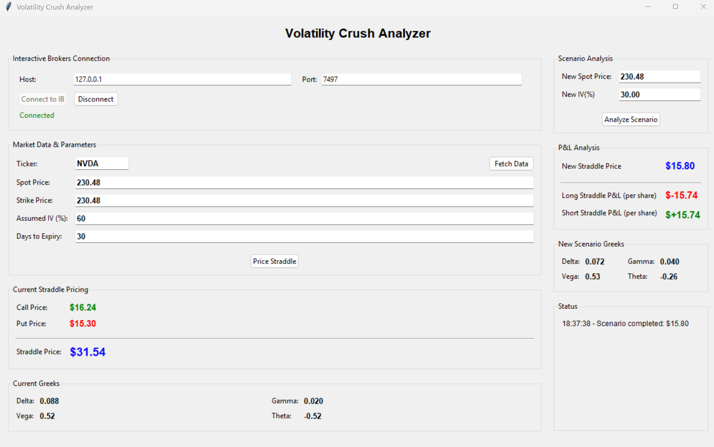

# Volatility Crush Analyzer

A Python desktop application for exploring how changes in stock price and assumed implied volatility affect the theoretical value and Greeks of a straddle. It combines a Tkinter interface, Black–Scholes pricing, and Interactive Brokers stock-price data.


## Preview



With spot and expiry unchanged, reducing assumed IV from 60% to 30%
lowers the theoretical straddle value from $31.54 to $15.80,
producing a $15.74 loss per share for the long straddle.

## Features

- Connect to Interactive Brokers TWS or IB Gateway using configurable host and port settings.
- Request a stock-price snapshot, with historical closing-price fallback.
- Price a call and put with the same strike and expiry as a straddle.
- Display combined straddle delta, gamma, vega, and theta.
- Change spot price and assumed IV to reprice the straddle and compare theoretical long and short P&L.
- Inspect the Greeks under the new scenario.

## Data and modeling choices

Interactive Brokers supplies the **underlying stock price**. The application requests delayed market data and falls back to a historical close when necessary; data availability depends on the IBKR connection and account permissions.

**IV is entered manually**, with a default of 30%. The application does not retrieve option-chain quotes, calculate IV from option prices, or detect earnings dates. Call and put prices are theoretical model values.

The default strike is set equal to the fetched spot price for an at-the-money example. Users can edit the strike, spot, IV, and days to expiry. This default strike does not necessarily correspond to a listed option contract.

## Setup

Install the dependencies from the repository directory:

```bash
python -m pip install -r requirements.txt
```

Tkinter must also be available in your Python installation. Check it with:

```bash
python -m tkinter
```

Start TWS or IB Gateway and configure it to accept API connections. The application's defaults are host `127.0.0.1` and port `7497`; enter the port configured in your own installation. The API client ID is currently fixed at `0` in the source code.

Run the application:

```bash
python volatility_crush_analyzer.py
```

## Usage

1. Enter the connection host and port, then select **Connect to IB**.
2. Enter a ticker, such as `NVDA`, and select **Fetch Data**.
3. Review the stock price and edit the strike, assumed IV, and days to expiry.
4. Select **Price Straddle** to calculate the baseline value and Greeks.
5. Enter a new spot price and IV under **Scenario Analysis**.
6. Select **Analyze Scenario** to view the repriced straddle, theoretical P&L, and updated Greeks.

For example, hold spot and expiry constant and reduce assumed IV from 60% to 30%. This isolates the effect of a volatility reduction on the model price. Changing spot at the same time explores how a stock move can offset or compound that effect.

## Pricing and output conventions

- Black–Scholes pricing assumes European exercise, no dividends, and constant volatility within each valuation.
- The risk-free rate is fixed at **5%** in the source code; it is a modeling assumption, not a fetched market rate.
- Time to expiry uses calendar days divided by 365. Scenarios keep time to expiry unchanged, so they do not simulate elapsed time across an earnings announcement.
- Prices and P&L are **per share**, without a contract multiplier or position sizing.
- Long P&L is scenario value minus baseline value; short P&L is its negative.
- Greeks describe the combined **long straddle**. Short-position Greeks have the opposite signs.
- Vega is reported per one percentage-point change in IV; theta is reported per calendar day.
- Spot, strike, IV, and days to expiry must be positive finite values. Zero IV and expiry-day valuation are not supported.

## Limitations

The application is a scenario-analysis tool rather than a historical earnings backtest. It does not model volatility smiles, dividends, early exercise, transaction costs, bid–ask spreads, execution, or delta hedging. P&L represents a change in theoretical value rather than realized trading performance. It does not place orders.

The numerical pricing routines have been checked against put–call parity and finite-difference straddle gamma and vega. End-to-end IBKR connectivity must be verified in a configured local TWS or Gateway session.

## License

MIT. See [LICENSE](LICENSE).
